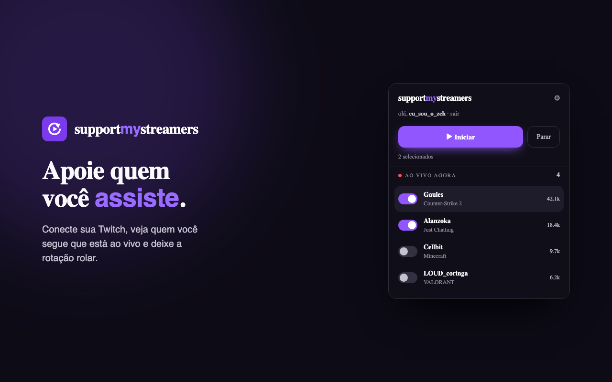
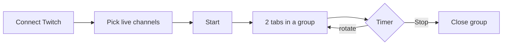

<p align="center">
  <picture>
    <source media="(prefers-color-scheme: dark)" srcset="assets/lockup-light.png" />
    <source media="(prefers-color-scheme: light)" srcset="assets/lockup-dark.png" />
    
  </picture>
</p>

<p align="center">
  <strong>Lurk the Twitch channels you follow — two at a time, on autopilot.</strong>
</p>

<p align="center">
  
  
  
  
  <br />
  <a href="https://github.com/jaugustodafranca/support-my-streamers/actions/workflows/ci.yml"></a>
  <a href="LICENSE"></a>
</p>

<p align="center">
  
</p>

<p align="center">
  <sub>Connect · pick who's live · start · the extension rotates 2 streams in a tab group</sub>
</p>

---

## Why this exists

You already follow great streamers. Keeping two live tabs open and switching by hand is tedious. **Support My Streamers** does the lurking for you — channels **you** chose, a real browser session, no chat bots, no server pushing audiences.

## Highlights

<table>
<tr>
<td width="50%" valign="top">

**Live dashboard**  
See who you follow that is live — game, viewers, toggles.

**FIFO rotation**  
Shuffled once, fair queue; offline channels skip automatically.

**Tab group**  
Streams open in a **Support My Streamers** Chrome group.

</td>
<td width="50%" valign="top">

**Progress bar**  
YouTube-style countdown until the next switch.

**Active indicator**  
Red dot on the toolbar icon while rotation runs.

**Muted tabs, loud player**  
Browser tab silent; Twitch player volume stays up.

</td>
</tr>
</table>

<p align="center">
  
  &nbsp;&nbsp;→&nbsp;&nbsp;
  
  <br />
  <sub>Idle · playing</sub>
</p>

## How it works



1. **Connect** — OAuth with scope `user:read:follows` only.  
2. **Select** — toggle streamers in the popup.  
3. **Start** — opens up to 2 live tabs; icon shows a red dot.  
4. **Stop** — closes the group and ends rotation.

Details: raid/offline rules, audio, sync cycle → **[how-it-works.md](how-it-works.md)**

## Quick start

| | |
|---|---|
| **Chrome Web Store** | Install when published |
| **Unpacked (dev)** | `npm install && npm run secrets:inject`, then `chrome://extensions` → Developer mode → Load unpacked → this folder |

End users only click **Connect with Twitch** — no Client ID setup.

## Development

<details>
<summary><strong>One-time developer setup</strong></summary>

<br />

**Prerequisites:** Node.js 18+ · [Twitch Developer app](https://dev.twitch.tv/console/apps)

```bash
npm install
cp .env.example .env
# TWITCH_CLIENT_ID=... in .env
npm run secrets:inject
```

Register redirect URL in the Twitch app:

`https://<extension-id>.chromiumapp.org/`

**GitHub Actions:** repository secret `TWITCH_CLIENT_ID` (CI injects before zip).  
Chrome Web Store secrets (`CHROME_*`) stay in GitHub only — not in `.env`.

```bash
npm test              # 48 tests
npm run build         # build/support-my-streamers-<version>.zip
npm run icons:active  # regenerate active toolbar icons
```

</details>

<details>
<summary><strong>Project layout</strong></summary>

<br />

```
src/
  background.js     Service worker (Chrome APIs only)
  rotation.js       FIFO queue — pure, tested
  twitchApi.js      Helix wrapper
  popup/            Start / stop, channel list, cycle bar
  options/          Interval, audio, language
test/
AGENTS.md           AI assistant guide
```

**AI assistants:** [AGENTS.md](AGENTS.md) · [coding standards](.cursor/rules/coding-standards.mdc)

</details>

## Contributing

Issues and PRs are welcome!

1. **Fork** the repo and create a branch from `main`.
2. **Set up**: `npm install && cp .env.example .env` (your Twitch Client ID) `&& npm run secrets:inject`.
3. **Make your change** — English-only code, UI text in `src/i18n.js` (PT + EN).
4. **Test**: `npm test` must pass (CI runs it on every PR).
5. **Open a PR** with a [Conventional Commit](https://www.conventionalcommits.org/) title (`feat:`, `fix:`, `docs:`…) — it drives automated releases.

Full guide: **[CONTRIBUTING.md](CONTRIBUTING.md)** · architecture boundaries: [AGENTS.md](AGENTS.md)

## Ethics & privacy

Personal lurking for channels you already follow — not viewbotting. No analytics, no servers of ours.  
[Privacy policy](PRIVACY.md) · [Design notes](docs/superpowers/specs/2026-06-10-twitch-lurker-extension-design.md)

## License

[MIT](LICENSE)

<p align="center">
  <sub>powered by <a href="https://zaintech.com.br">zaintech.com.br</a></sub>
</p>
